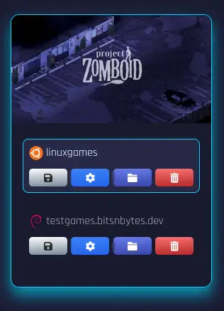
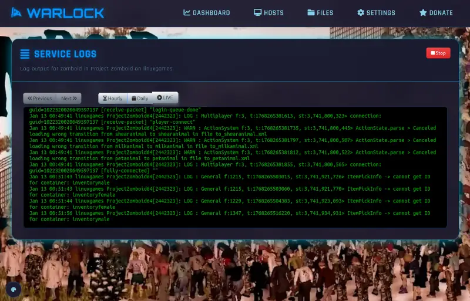
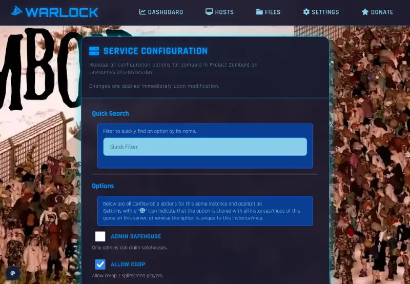
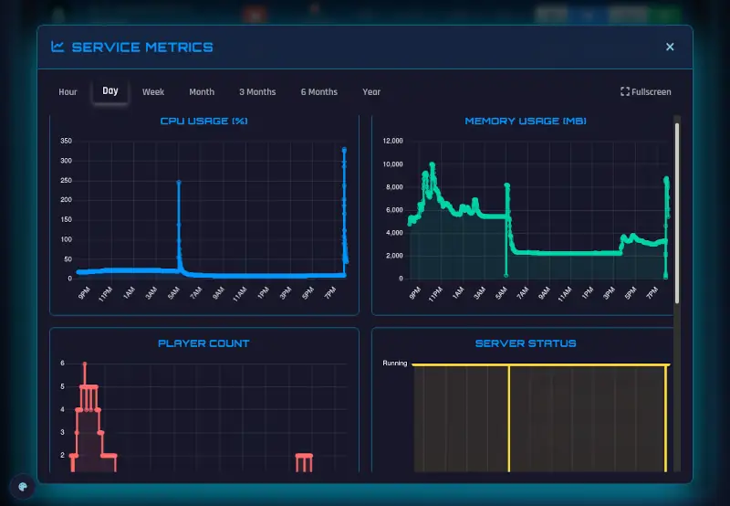
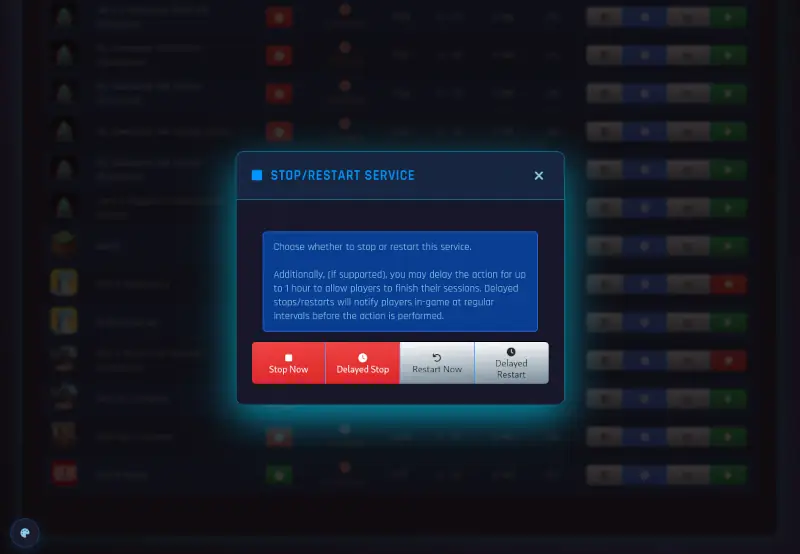

# Warlock Dashboard

The dashboard in Warlock shows an overview of all games installed,
along with each game instance under each game.

The dashboard is broken into two sections; Game Installs and Game Instances.

Most games only have a single instance, but some, like ARK Survival Ascended, 
provide multiple maps for a single game installation.

## Game Installs

The top section of the page lists all game installations and which hosts they are installed on.

If you have multiple hosts in your Warlock cluster, a game may be installed on multiple hosts.

Each game / host provides options to:

* [Manage Backups](game-backup.md)
* [Configure Game](game-config.md)
* [Browse Files](files.md)
* Uninstall Game

## Game Instances

Each game instance provides options to:

* Enable/Disable on boot
* View Logs
* Change Options
* View Metrics
* Start/Stop/Restart the game server

In addition to controls, the listing also shows:

* Server status (up/down)
* Current player counts
* Cpu usage
* Memory usage

These stats are updated automatically every minute.

### On-Boot

Clicking on the on-boot icon toggles if the game instance starts automatically on server boot.

### Logs

Clicking the "Logs" button opens the game output log with options to view per-hour, per-day, or realtime.

### Options

Provides an interface to adjust game and instance options for the game.
Any option with a globe icon affects all instances of that game on that host.

**While the server is running**, options cannot be changed.

### Metrics

Provides metric charts for a game instance, including

* CPU Usage
* Memory Usage
* Player Count
* Server Status (up/down)
* API Response Time

### Start/Stop/Restart

Provides buttons to start, stop, or restart the game server instance.

Start will issue the start command immediately and will change the service record to a 15-second updater timer.

Stop will bring up a modal where you can choose to either stop or restart.

For both stop and restart, the server **will not immediately** stop or restart if players are online.
Instead it sends a 5-minute warning message to players.

Additionally for supported game servers, a delayed option may be supported,
where players are given a 1-hour timer before the stop/restart is performed.

This option can be useful for games in which players may be busy with a raid for a while.

