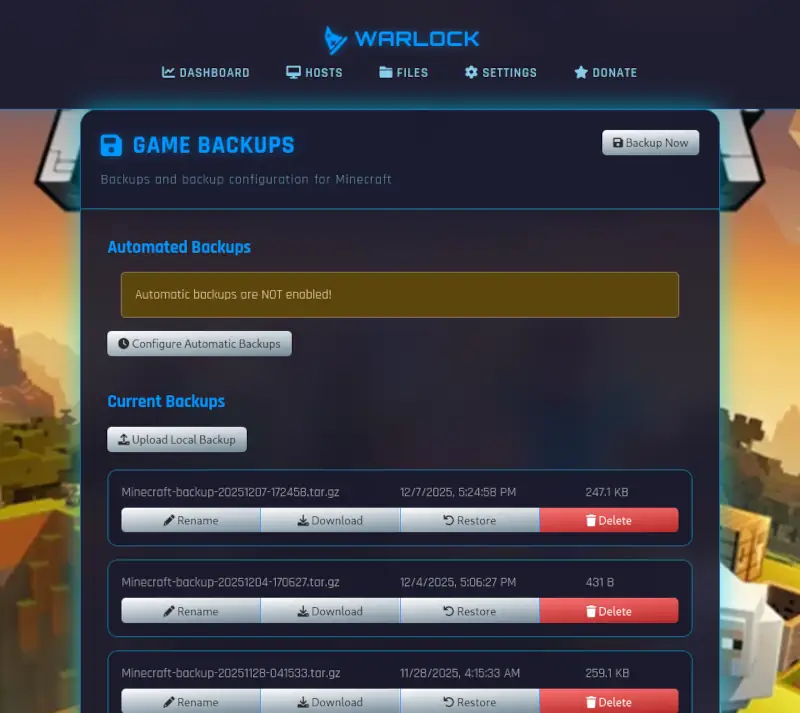

# Game Backups

Most Warlock-compatible game servers provide support for backups, and the web interface makes it easy to manage them.

Backups are stored on the server host which serves the game,
so it is **your responsibility to copy them offsite when needed**.

## Creating Backups

Manual backups can be created as needed by clicking on "Backup Now".
This will bundle a backup of the player data and store it within `backups/` inside the game's directory.

## Automatic Backups

Backups can be performed automatically on a simple schedule.

* Hourly
* Daily at a specific hour
* Weekly on a specific day and hour

Additionally, you can specify how many backups to retain before older backups are deleted.

For example, if automated backups are set to daily and max backup is set to 14,
you will have the latest 2 weeks of backups stored.

## Renaming Backups

Sometimes a specific backup may be needed for a specific purpose, such as prior to installing or changing mods.

As long as the backup is renamed to something other than `GameName-backup-...`, it will be preserved on the server, even if max backups are exceeded.

For example, for Minecraft, automatic backups are named starting with `Minecraft-backup-...`.

If you rename a snapshot to `Premods-this-works`, it will be preserved until you manually delete it.

## Downloading / Uploading Backups

Backups can be downloaded to your local computer for safekeeping by clicking the download icon next to the backup.

Additionally, you can upload a backup from your local computer to the server by clicking "Upload Backup".
This can be useful for migrating game servers.

(Please ensure that the uploaded backup is compatible with the game server version you are using.)

## Restoring Backups

To restore a backup, simply click the **Restore** button next to the desired backup.