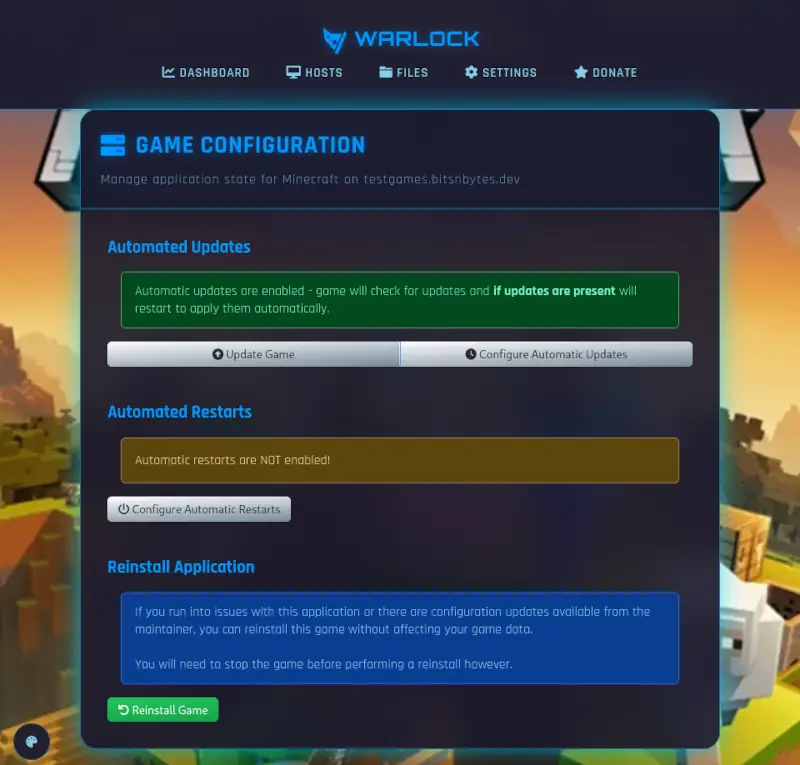

# Game Configuration

Game configuration allows for managing the game binary.

## Manual Updates

Provides the ability to manually update the game server binary to the latest version.
Expects the game to be stopped prior to updating.

## Automatic Updates

Enables automatic updates for the game server binary when a new version is detected.

By default, updates are skipped if players are online, 
but this can be changed in compatible games with a 1-hour warning to players in-game.

The schedule for automatic updates can be set to:

* Hourly
* Daily at a specific hour
* Weekly on a specific day and hour

## Automatic Restarts

Some games may benefit from periodic restarts to help maintain performance and stability.
This functionality allows for automatic restarts on a schedule.

* Hourly
* Daily at a specific hour
* Weekly on a specific day and hour

## Reinstall Game

Provides an option to reinstall the Warlock management script, config definitions, and game server binary.

Reinstalling **will not** remove player data or configuration.