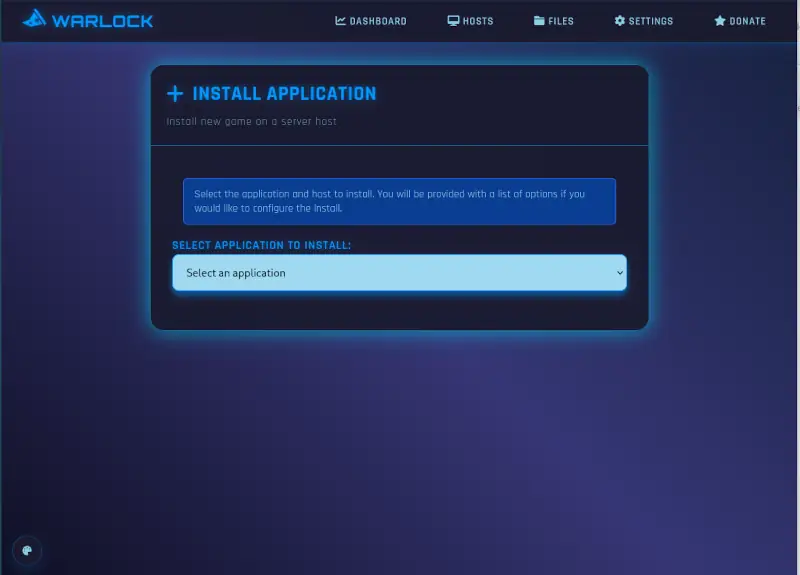
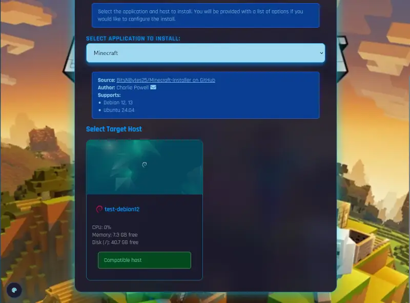
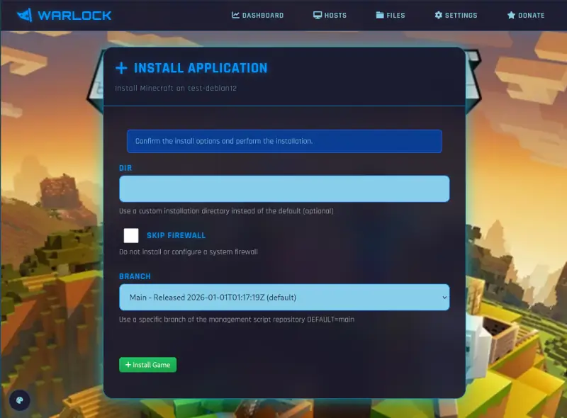
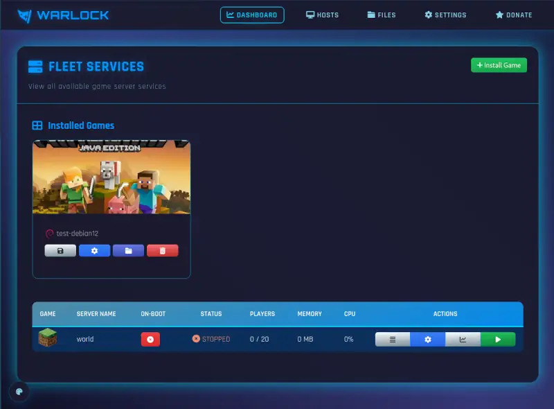

# Installing a Game

From the dashboard, click "Install Game" to begin installing a new game server.
You will be prompted with which game you would like to install.

Selecting a game will load the hosts in your cluster, along with if it can support that game
and if it's already installed.

Select a host to install the game server on to open the installation options.

Most games can be installed without the options needing changed, and different games will have different options.

Clicking "Install Game" will begin the installation process on the target host.
Please keep the window open while the installation is in progress.

Once installed, clicking back to the dashboard will show the new game server listed.

