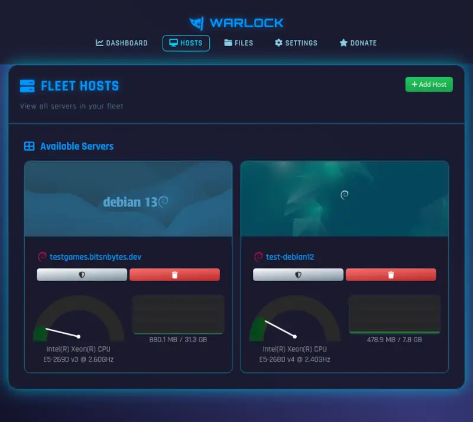
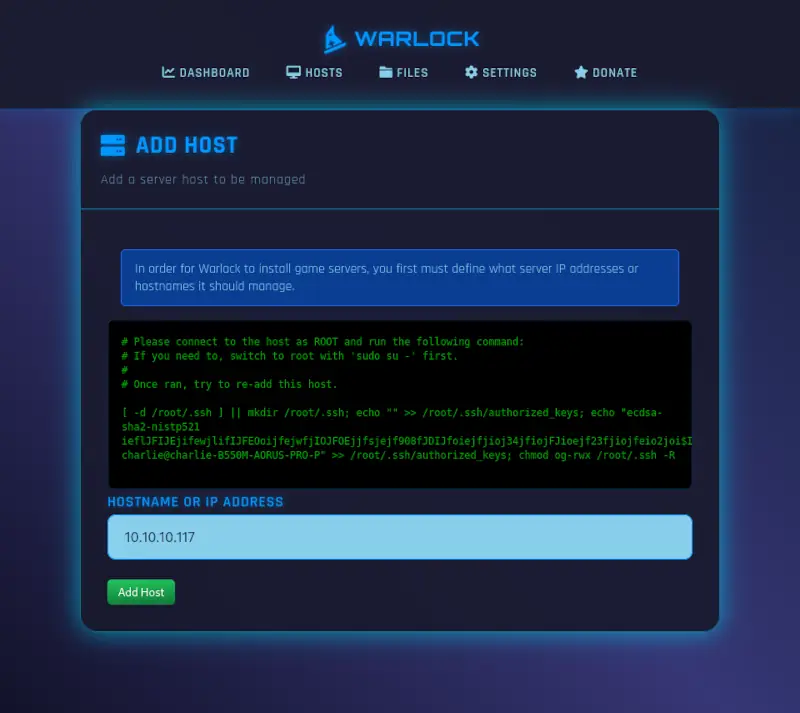
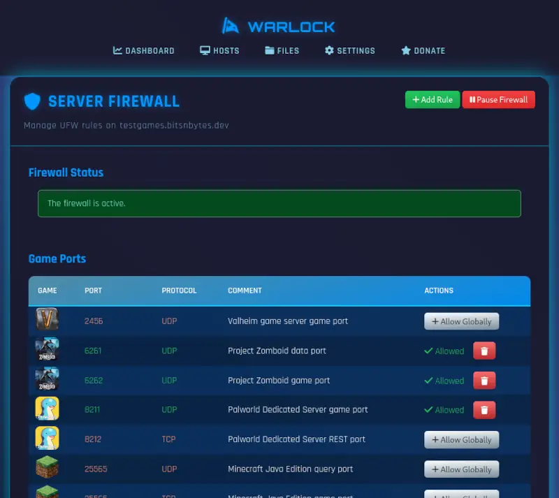

# Warlock Server Hosts

Warlock by default provides access to install game servers on the host which it is installed on,
but it can also handle multiple hosts in a game cluster.

This allows you to have multiple servers for different games, or even the same game on different hosts.



## Adding Host

Adding a new host to Warlock is done via the "Add Host" button on the Hosts page.

The process is relatively simple, but will require SSH access to the target host
and manually running a command to authorize Warlock.

Enter the IP address or hostname of the target host and click 'Add Host'



The first attempt to add a host will usually fail, as Warlock needs to be authorized.

Connect to the target host via SSH and **as root** run the command provided by Warlock.

For example the command may be something similar to:

```bash
[ -d /root/.ssh ] || mkdir /root/.ssh; 
echo "" >> /root/.ssh/authorized_keys; 
echo "ecdsa-sha2-nistp521 Warlock-public-ssh-authorization-key-string== root@warlock-management-host" >> /root/.ssh/authorized_keys; 
chmod og-rwx /root/.ssh -R
```

Once you successfully run the command on the target server host, click 'Add Host' again to retry adding the host.

Supported hosts are:

* Debian (recommended)
* Ubuntu (recommended)
* Fedora
* RHEL/Rocky
* SuSE
* Arch

## Host Firewall

To help secure your game servers, most Warlock games will automatically install `UFW`
for a host firewall. 
This firewall can be managed via the "Firewall" option on each host.



Custom rules can be added to your host firewall as needed,
and game ports will be listed to offer a one-click option to open game ports.

(Please note, some ports like Palworld's REST port should not be globally available.)

Most games will automatically add the necessary rules when installed.