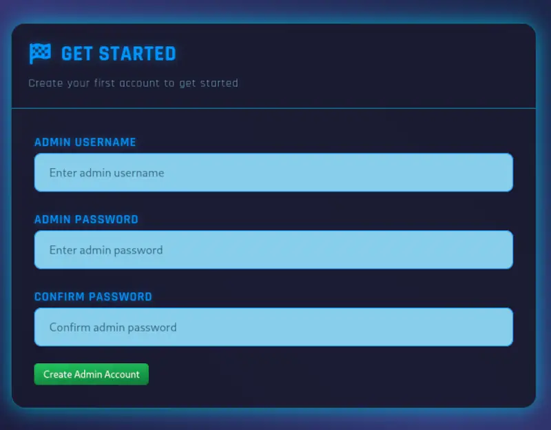
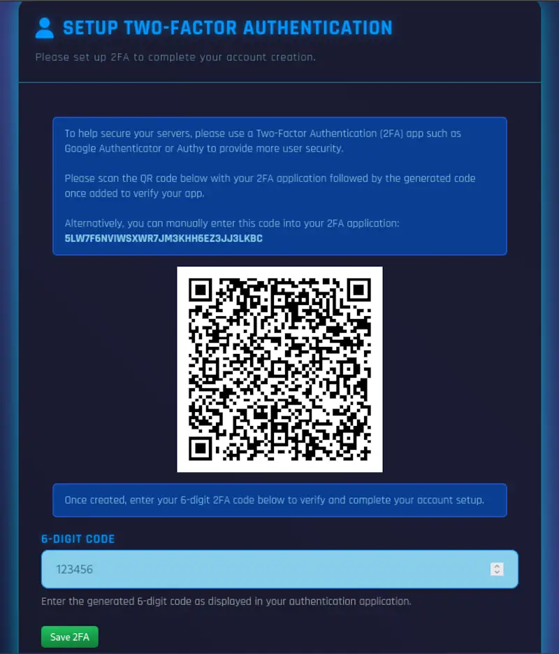
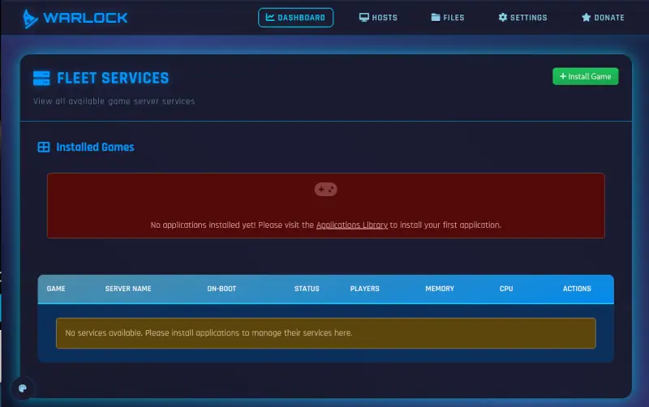

# Installation

To install Warlock on a server, follow these steps to install the application from source.


## Service Installation

It's a Node.JS application so very few dependencies are required, and those that are should be installed automatically.

Before installing, decide if you will be accessing the web application via a domain name or directly via IP address.
It is recommended to use a domain name as it will allow for an SSL certificate to be installed.

A domain name and SSL can be skipped if you will be accessing the server via a protected network or VPN.

```bash
# Install Git if not already installed
# For Debian/Ubuntu
apt install git
# For Fedora/RHEL
dnf install git
# For Arch Linux
pacman -S git

# Ensure www directory exists to contain Warlock
mkdir -p /var/www
chmod a+rx /var/www
cd /var/www

# Checkout Warlock and run installer
git clone https://github.com/BitsNBytes25/Warlock.git
cd Warlock
./install-warlock.sh
```

This installer will ask a few questions about your setup.  Once answered, Warlock should be installed and running.

## First Run - User Creation

Once installed, access Warlock via its domain name or IP address in a web browser.
You will be prompted to create an admin user for the application.

(Additional users can be created later via the Users section in the Settings menu.)



Once created, you will be prompted to configure two-factor authentication.



This supports any 2FA provider which utilizes the standard TOTP protocol, such as Google Authenticator or Authy.

Two-factor authentication can be disabled, though is highly recommended to remain enabled to protect your server.

## First Run - Dashboard

Upon completion of your user account and 2FA, you will be taken to the main dashboard of Warlock.

